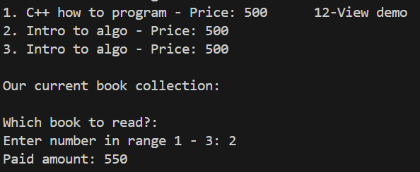

# Quantum-Bookstore
## Online Book Reader System

An interactive console-based C++ application that simulates an online book store and reader system. It allows users to browse, buy, and read books (both eBooks and paper books), view reading history, and manage their personal profiles. Administrators can manage inventory, remove expired books, and add new titles.
System Design and Architecture

In addition to sending purchased books (or demos) to users via simulated email or delivery service, the system allows users to **open a reading session inside the application itself**.
- Users can navigate pages forward and backward.
- Sessions track the page number and last session date.
- Reading history is saved and viewable later.

## Why Demos are EBooks — Not a Separate Demo Class
One of the system’s important features is allowing users to preview books via demos.
Instead of creating a separate Demo class, I made the demo itself an EBook object.

Advantages:
    -Reusability: Demos naturally need pagination, page reading, and session management — all features already built into EBook.
    -No Code Duplication: Avoids writing and maintaining a second, similar class just for previews.
    -Consistent API: Both demos and full eBooks behave the same way — following polymorphic principles.
    -Future-Proof: If later we want to add ratings or notes to demos, the existing EBook class can handle it without changes elsewhere.

## Why Add a Product Base Class

To keep the system extensible and maintainable, we introduced a base class Product — from which Book inherits.
This anticipates potential future features like selling other products (e.g., gift cards, accessories, or subscriptions) without rewriting the purchasing and inventory logic.

Benefits:
   romotes Open/Closed Principle (open for extension, closed for modification)
   Central abstraction for all sellable items
   Simplifies purchase handling via polymorphism
   Cleanly separates shared and specific behaviors between product types

#ScreenShots for the app:

